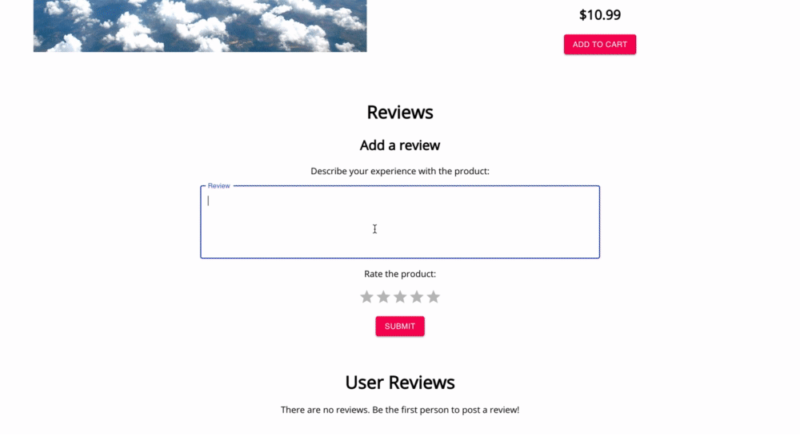
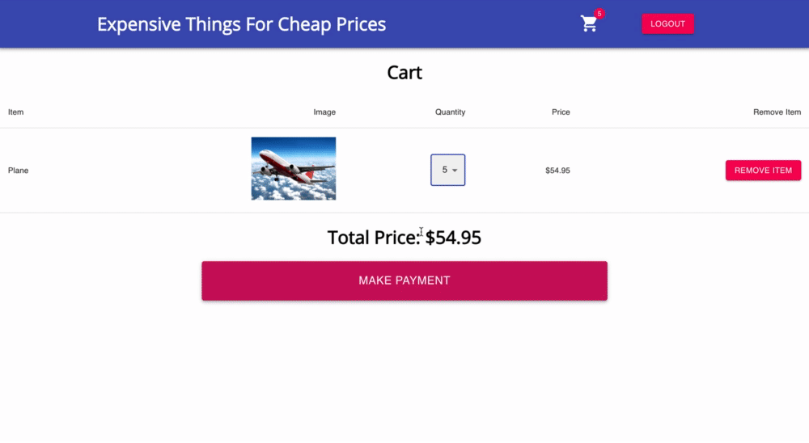

# BargainBucket
# Quick demo

After the user has signed in and been authenticated with a JWT, they are brought to the product page.

Users can then click on a product, which displays info about the product and gives them an option to add the item to the cart.

Below, a user can post a review and view what other users have said about the product.

The user can then view their cart and change the quantity of the item, or remove it completely.

Finally, the user can submit their payment (using a test credit card). 

